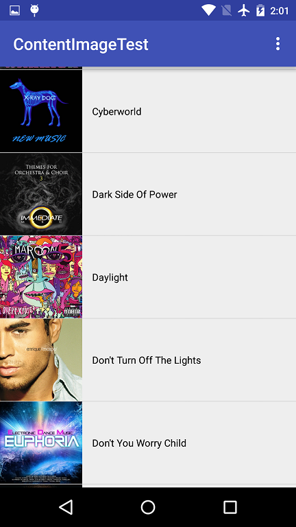
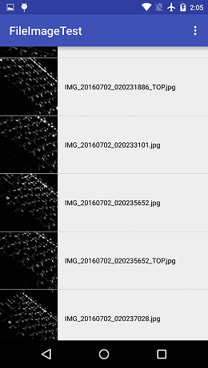

# ImageLoader
Android image loader library

[  ](https://bintray.com/nickandroid/maven/imageloader/_latestVersion)







### Usage
mvn:
```
<dependency>
  <groupId>dev.nick</groupId>
  <artifactId>imageloader</artifactId>
  <version>0.1</version>
  <type>pom</type>
</dependency>
```

gradle
```
compile 'dev.nick:imageloader:0.1'
```

### Samples

Config:
```java
public class MyApp extends Application {
    @Override
    public void onCreate() {
        super.onCreate();
        ImageLoader.init(getApplicationContext(), new LoaderConfig.Builder()
                        .cachePolicy(new CachePolicy.Builder()
                        .preferredLocation(CachePolicy.Location.EXTERNAL)
                                .compressFormat(Bitmap.CompressFormat.PNG)
                                .build())
                        .cachingThreads(Runtime.getRuntime().availableProcessors())
                        .loadingThreads(Runtime.getRuntime().availableProcessors() * 2)
                        .diskCacheEnabled(true)
                        .memCacheEnabled(true)
                        .debug(true)
                        .build());
    }
}
```

Example usage:
```java
ImageLoader.getInstance().displayImage(uri, holder.imageView,
                        new DisplayOption.Builder()
                                .imageQuality(DisplayOption.ImageQuality.FIT_VIEW)
                                .loadingImgRes(R.drawable.ic_cloud_download_black_24dp)
                                .defaultImgRes(R.drawable.ic_broken_image_black_24dp)
                                .bitmapProcessor(new BlackWhiteBitmapProcessor())
                                .imageAnimator(new FadeInImageAnimator())
                                .build());
```

Freeze:
```java
ImageLoader.getInstance().freeze();
```

Resume:
```java
ImageLoader.getInstance().resume();
```

Clear tasks:
```java
ImageLoader.getInstance().clearTasks();
```

Terminate:
```java
ImageLoader.getInstance().terminate();
```

Clear cache:
```java
 @Override
    public void onTrimMemory(int level) {
        super.onTrimMemory(level);
        ImageLoader.getInstance().clearMemCache();
    }
```
```java
@Override
    protected void onDestroy() {
        super.onDestroy();
        ImageLoader.getInstance().clearAllCache();
    }
```

### Supported content:
```java
file://
```
```java
content://
```
```java
http://
```
```java
assets://
```
```java
drawable://
```